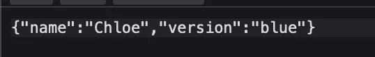
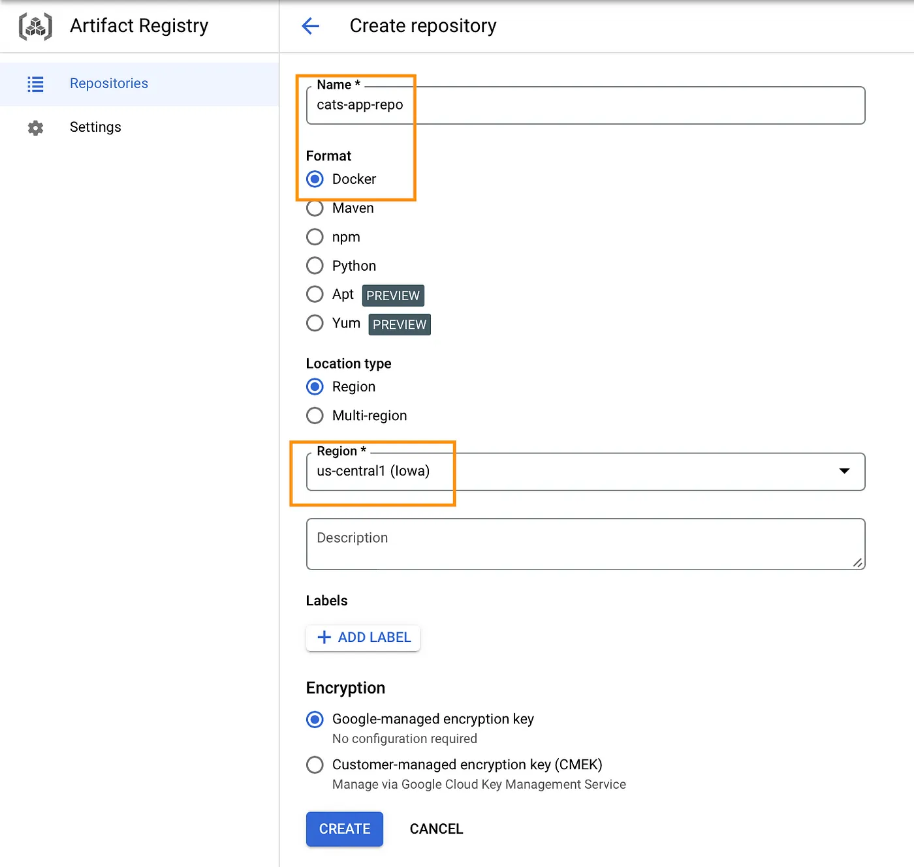
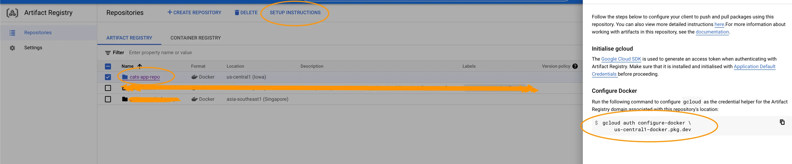
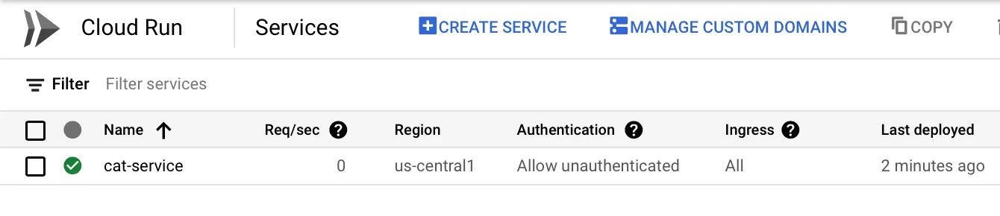
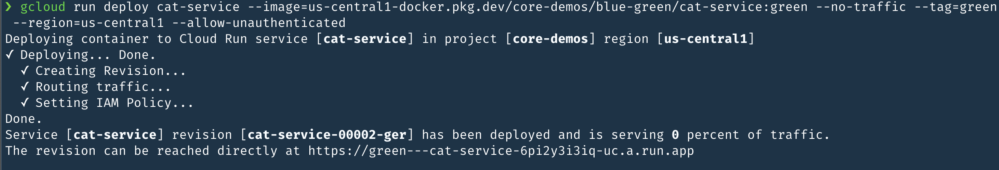
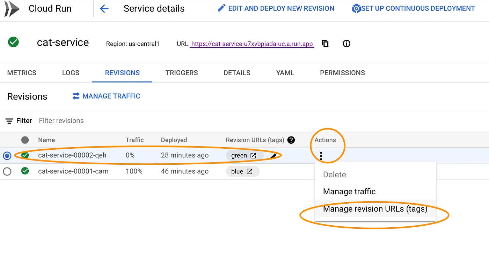
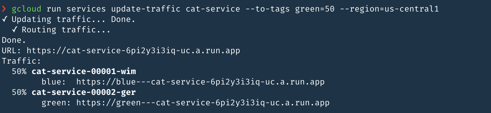

# Cloud Run Blue/Green Deployments

## Google Cloud services which we will be using

- [Artifact Registry](https://cloud.google.com/artifact-registry)
- [Cloud Run](https://cloud.google.com/run)


Our simple microservice contains a cat endpoint, which returns a random cat name in the below format


### Artifact Registry

Create a repository in the Artifact Registry, give it a name and select a region.


Once the repository is created, run the setup instructions on your machine. The setup instructions are available in the console, this command will change based on the region that you select during the repository creation.

```
gcloud auth configure-docker us-central1-docker.pkg.dev
```

### Build and push the Docker image to Artifact Registry

Below commands are used to build and push the container image to the repository that we created in Artifact Registry

```
docker build -t cat-service-blue .
docker tag cat-service-blue us-central1-docker.pkg.dev/core-demos/blue-green/cat-service:blue
docker push us-central1-docker.pkg.dev/core-demos/blue-green/cat-service:blue
```

Once the image is pushed, we can view it in the Artifact Registry


### Cloud Run

Run the below gcloud command to run our cat-service on Cloud Run using the image that we pushed to Artifact Registry,

```
gcloud run deploy cat-service --image=us-central1-docker.pkg.dev/core-demos/blue-green/cat-service:blue --tag=blue --region=us-central1 --allow-unauthenticated
```
We can view our cat-service in the console,


Access the url of the cat-service and test the /cat endpoint


[https://cat-service-u7xvbpiada-uc.a.run.app/cat](https://blue---cat-service-6pi2y3i3iq-uc.a.run.app/cat) endpoint is working fine, and is using the image with blue tag


## Gradual rollout and traffic migration
Now, lets update the service(the response) and run it on Cloud Run

```
vim index.js
```
Replace blue with green in the code

Lets push this new change to to Artifact Registry

```
docker build -t cat-service-green .
docker tag cat-service-green us-central1-docker.pkg.dev/core-demos/blue-green/cat-service:green
docker push us-central1-docker.pkg.dev/core-demos/blue-green/cat-service:green
```

Now, lets run this new change(image with green tag) of our cat-service on Cloud Run and instruct Cloud Run not to migrate the traffic to this new revision/version using the “no-traffic” flag

```
gcloud run deploy cat-service --image=us-central1-docker.pkg.dev/core-demos/blue-green/cat-service:green --no-traffic --tag=green --region=us-central1 --allow-unauthenticated
```

CloudRun will generate a separate url for the new revision. That URL can be used for testing the new service with zero live traffic


We can get this URL from the console as well and you can see in the console that this new revision is not serving any traffic ( Traffic 0%)


We can validate this revision and If we are happy with our new revision, we can gradually migrate traffic to our new revision using this command (here I have given 50, which means 50% of the traffic will hit the new revision(green) and 50% will hit the blue).
```
gcloud run services update-traffic cat-service --to-tags green=50 --region=us-central1
```

Now, when we access our cat-service URL we get 50% blue responses and 50% green



We can keep increasing the traffic flowing to our new revision and once we are happy with it, we can set to 100%
```
gcloud run services update-traffic cat-service --to-tags green=100 --region=us-central1
```

## Rollback

We can rollback at anytime If we find an issue with our new revision, we can rollback to the previous revision(one with blue tag) using this command

```
gcloud run services update-traffic cat-service --to-revisions cat-service-00001-cam=100 --region=us-central1
```
